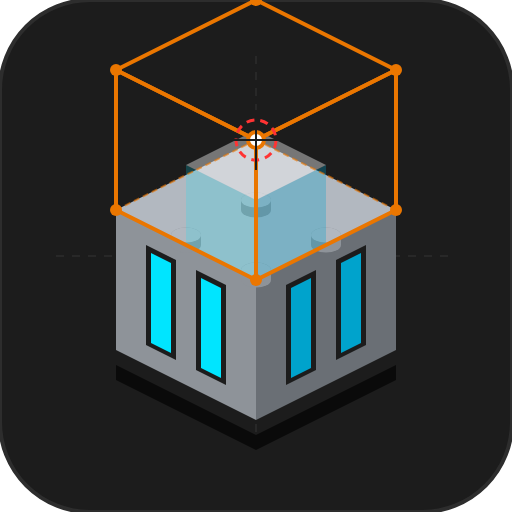
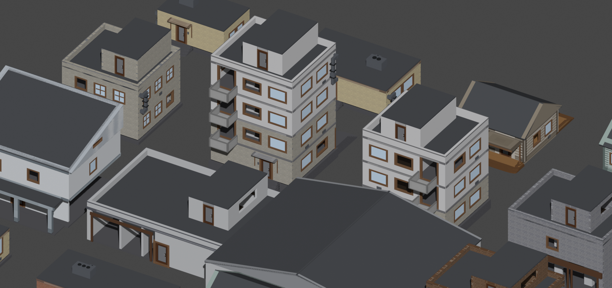
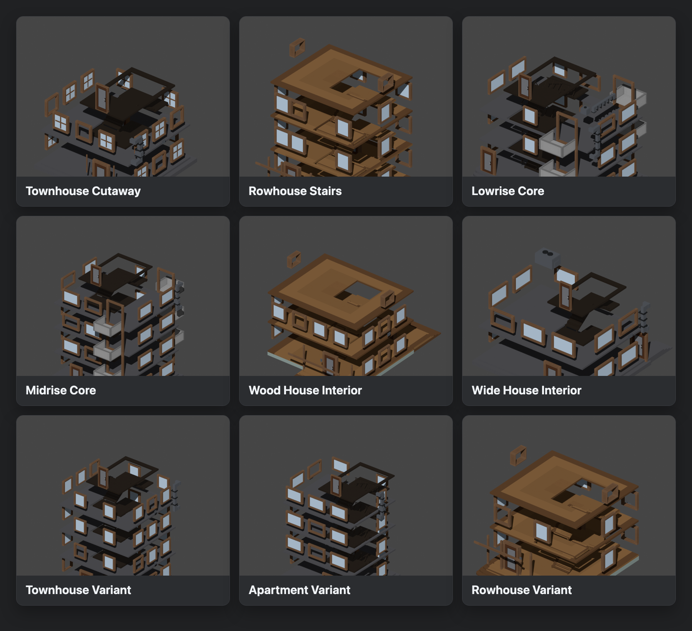

<table>
  <tr>
    <td width="112">
      
    </td>
    <td>
      <h1>LuArch</h1>
      <p>Procedural low-poly tactical buildings for Blender and game-engine workflows.</p>
    </td>
  </tr>
</table>



## Interior Gallery



LuArch is a Blender 4.5+ addon for generating editable urban combat buildings from deterministic presets. It is built for fast blockout, repeatable variants, validation before export, and Roblox-oriented pipelines that need visual meshes plus runtime metadata.

The project includes the Blender addon, randomized preset generation, selected-building edit/regenerate tools, validation gates, export helpers, and an optional Roblox Studio post-processor plugin.

## What It Does

- Generates residential, rowhouse, apartment, warehouse, hangar, market, depot, and industrial-style low-poly buildings.
- Uses seed-backed randomization, so variants can be reproduced.
- Keeps generated buildings editable from the Blender sidebar.
- Builds larger district/block layouts for fast urban layout exploration.
- Validates selected buildings before export.
- Exports render FBX plus an RBXMX sidecar for Roblox-side setup.
- Includes an optional Roblox Studio post-processor for sidecar attach and runtime setup.

Additional diagrams and workflow notes are in [`docs/quickstart.md`](docs/quickstart.md), [`docs/export-pipeline.md`](docs/export-pipeline.md), and [`docs/validation.md`](docs/validation.md).

## Install

1. Download the latest release zip from GitHub Releases.
2. In Blender, open `Edit -> Preferences -> Add-ons`.
3. Click `Install...` and select the release zip.
4. Enable `LuArch`.
5. Open the 3D View sidebar and select the `LuArch` tab.

No activation key is required. See [`docs/licensing-and-install.md`](docs/licensing-and-install.md).

## Quick Start

1. Choose a preset in the `Single Building` panel.
2. Click `Randomize Settings` to generate a seed-backed variant.
3. Click `Generate Building`.
4. Select the generated root object and adjust supported settings.
5. Click `Validate Selected`.
6. Use `Quick Export Selected` when the building is ready.

## Export Pipeline

LuArch separates render geometry from runtime metadata:

- FBX contains the visual meshes.
- RBXMX contains the sidecar contract for runtime data.
- Validation checks the selected root before export.
- The optional Studio plugin consumes the sidecar and performs Roblox-side setup.

## Development

Clone the repository, then either install the folder as a Blender addon or symlink `luarch/` into Blender's addon directory.

Basic local check:

```bash
python3 -m compileall luarch
python3 scripts/build_release.py
```

The generated release zip is written to `dist/`.

## Project Status

This is an early open-source release of a production-oriented authoring tool. The current focus is documentation, installability, preset quality, validation coverage, and export reliability.

Roadmap: [`docs/roadmap.md`](docs/roadmap.md)

## License

GPL-3.0-or-later. See [`LICENSE`](LICENSE).
